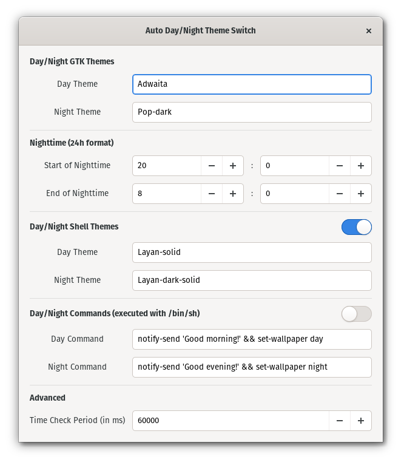

# Auto Day/Night Theme Switch (`adnts`)

A GNOME extension to automatically switch theme depending on the time of the day


## Features



- Customize your day/night GTK themes
- Tweak when the day/night change happen
- Edit how often the extension should look for the day/night change (Advanced)

## Limitations

- You cannot change the GTK theme the usual way anymore, use `adnts`'s preferences panel instead
- Note: No modifications to your system are made, it's just that this extension will assume what is inside its preferences is the theme you want and it will always change it back to that
- It can **only** change the GTK theme
- It cannot run custom scripts
- 24h format only in the preferences

## Install

Clone this repo and run `./install.sh path/to/install/dir` from the clone to
create the `adnts@n.darazaki` subdirectory and copy the required files into it

The `path/to/install/dir` parameter defaults to
`~/.local/share/gnome-shell/extensions`, the default user path where GNOME
searches for extensions

E.g. user installation:

```sh
git clone https://github.com/Darazaki/AutoDayNightThemeSwitch adnts
adnts/install.sh
```

E.g. root installation:

```sh
git clone https://github.com/Darazaki/AutoDayNightThemeSwitch adnts
sudo adnts/install.sh /usr/share/gnome-shell/extensions
```

After that, configure and enable the extension from GNOME Tweaks or with:

```sh
gnome-extensions prefs adnts@n.darazaki
gnome-extensions enable adnts@n.darazaki
```

Your GTK theme will be overridden with the ones specified in `adnts`'s
preferences panel so make sure to change your theme here

## Uninstall

```sh
# Add `sudo` if needed
rm -rf path/to/install/dir/adnts@n.darazaki
```

Then re-login to make sure GNOME unloaded the extension

## License

This project uses the GPLv3 license (see: [LICENSE.txt](LICENSE.txt))

## Contribute

Every kind of contribution is welcome!

If you want something to be changed, please open an issue or a PR and I'll take
a look at your suggestions ASAP

Any contribution will be published under the same licensing terms indicated
previously
